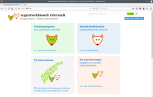
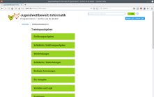
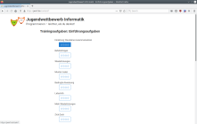
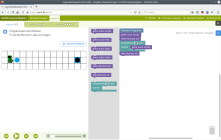
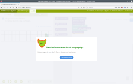
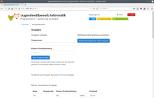

#  The Medal Contest Platform

[](https://crates.io/crates/medal)
[](https://jim.test.bwinf.de/doc/medal/)
[](https://git.bwinf.de/bwinf/medal/-/pipelines)
[](LICENSE)

Medal is a small platform for in-browser running contest written in rust.

It is designed for the German "Jugendwettbewerb Informatik", a computer science contest with tasks using Google Blockly as a programming language-replacement.

**Try it out on [jwinf.de](https://jwinf.de/)**

[Benutzerhandbuch (German manual)](manuals/Benutzerhandbuch.md)

## Screenshots

[](static/images/screenshots/index.png)
[](static/images/screenshots/training_list.png)
[](static/images/screenshots/training.png)
[](static/images/screenshots/task.png)
[](static/images/screenshots/task_solved.png)
[](static/images/screenshots/group_list.png)

## Translation

Currently there is no translation framework built into medal, but it is high on our todo list.

If you want to translate the platform or parts of it into another language, don't hesitate to let us know by opening a ticket or writing an email to jugendwettbewerb [a.t] bwinf.de.


## Folder structure (administration)

### `tasks/`

Contains all the tasks files and the contests.

Tasks are HTML files that are served directly and can reference other files (CSS, JS, images).

Contest are YAML files following a certain structure (see src/contestreader_yaml.rs). Upon start of the platform, the whole tasks directory and all subdirectories are scanned for .yaml files and every .yaml file is parsed as contest and inserted into the database or updated (if the filename stays the same).

#### `tasks/jwinf/` (using FIOI tasks)

In order to use the france-ioi-style tasks that are used on https://jwinf.de/, the wrappers files in `tasks/jwinf/` have to be used in contest definitions to wrap the tasks and allow for communication between task an plattform.

Also the repository https://github.com/France-ioi/bebras-modules.git has to be checked out, since the tasks depend on it. Usually it should be checked out at `tasks/jwinf/_common/modules`.

#### `tasks/teacher/`

The directory `tasks/teacher/` can contain an `index.html` file. This file is presented to teachers in the teacher area of the platfrom (in an iframe). Further sites or documents can be linked from it.


### `templates/`

The folder `templates/` contains the different template sets. The template set can be selected in `config.json` or via command line parameter. By default, the template set `default/` is chosen.

### `config.json`

The `config.json` configures the plattform (see src/config.rs).

## Running Medal

### Requirements

Needs library `libsqlite3-dev`.

Needs `rustc` and `cargo` 1.40 (stable) or higher.

Rust can be obtained here: https://rustup.rs/

### Run

Running
```
make
```
compiles and runs a debug-/test-server.

For production use, a release binary should be compiled and served behind a reverse proxy (nginx, apache, …).
```
make release
```
compiles a release build with openssl statically linked for distribution.

The directories `tasks/` and `static/` can (and for throughput-purposes should) be served by the reverse proxy directly.

## Deploy

It is recommended to run the platform behind a reverse proxy, that is serving static files directly. However, the contest YAML files should not be served to the user!

The following configuration can be used for an Nginx webserver:

```
upstream medal {
  server [::1]:8000;
}

server {
  # Other server settings here

  location ~* \.(yaml)$ {
    deny all;
  }

  location /static {
    add_header Cache-Control "public, max-age=604800";
  }

  location /tasks {
    add_header Cache-Control "public, max-age=604800";
  }

  location / {
    proxy_pass http://medal;
  }
```

The following configuration can be used for an Apache 2.4 webserver:

```
  ServerSignature Off
  ProxyPreserveHost On
  AllowEncodedSlashes NoDecode

  ProxyPass /static/ !
  ProxyPass /tasks/ !
  ProxyPass /favicon.ico !
  ProxyPass / http://[::1]:8080/
  ProxyPassReverse / http://[::1]:8080/

  Alias "/tasks/" "/path/to/medal/tasks/"
  Alias "/static/" "/path/to/medal/static/"
  Alias "/favicon.ico" "/path/to/medal/static/images/favicon.png"

  <filesMatch "\.(css|jpe?g|png|gif|js|ico)$">
    Header set Cache-Control "max-age=604800, public"
  </filesMatch>

  <FilesMatch "\.yaml$">
    Deny from all
  </FilesMatch>

  <Directory "/path/to/medal/static/">
    Require all granted
  </Directory>

  <Directory "/path/to/medal/tasks/">
    Require all granted
  </Directory>
```


## Contributing

Please format your code with `rustfmt` and check it for warnings with `clippy`.

You can install those with
```
rustup component add rustfmt --toolchain nightly
rustup component add clippy
```

Format the code and check for warnings with
```
make format
make clippy
```

## Folder structure (development)

### `migrations/`

Contains all the database migrations. New database migrations are applied when the platform is started. This can be disabled in the config or via command line switch.

### `src/`
#### `src/main.rs`

Entry point of the program and contains all integration tests.

#### `src/core.rs`

The core logic of all http endpoint.

#### `src/webfw_iron.rs`

Connects the core logic to the webframework (in this case `iron`).

#### `src/db_conn.rs`, `src/db_objects.rs`

Provides a database abstraction for the core logic.

#### `src/db_conn_*.rs`

Implement the database abstraction for different database types.

The files `src/db_conn_*.rs` are generated by `generate_connectors.sh` from `src/db_conn.base.rs` and `src/db_conn_*.header.rs`.

#### Other

  * `helpers.rs` small helper functions
  * `config.rs` parse config file
  * `contestreader_yaml.rs` parse contest files
  * `db_apply_migrations.rs` read `migrations/` directory and apply found files to migration functions of db connectors
